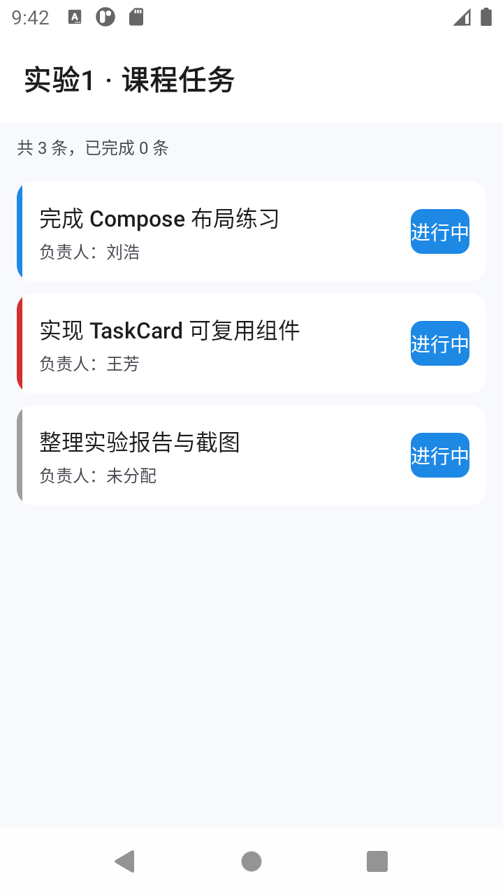

# 实验1 实验报告：Kotlin 与 Compose 开发环境及基础界面

| 项目 | 内容 |
|---|---|
| 姓名 | 刘浩 |
| 实验名称 | Kotlin 与 Compose 开发环境及基础界面 |
| 实验日期 | 2026-09-16 |
| 工程名称 | `Lab1ComposeBasics` |
| 代码仓库 | 见文末「七、提交记录与仓库关联」 |
| 运行入口 | `MainActivity`（应用名「实验1 · 课程任务」） |

---

## 一、实验环境

| 类别 | 版本 / 配置 |
|---|---|
| 操作系统 | Windows 11 |
| Android Studio | 与本项目 AGP 8.11.0 匹配的版本，内嵌 JBR |
| JDK | JDK 21（`D:\刘浩\Android\jbr`），项目 `jvmTarget = 17` |
| Android SDK | `D:\sdk`，`compileSdk = 35` / `targetSdk = 35` / `minSdk = 24` |
| 构建工具 | Gradle 8.13 + AGP 8.11.0 |
| Kotlin | 2.0.21（含 `kotlin-compose` 编译器插件） |
| UI | Jetpack Compose，BOM 2024.09.00，Material 3 |
| 测试 | JUnit 4.13.2（JVM 单元测试） |
| 构建命令 | `build.bat assembleDebug` / `build.bat testDebugUnitTest` |

环境验证结果：

```
> Task :app:assembleDebug
BUILD SUCCESSFUL in 1m 32s

> Task :app:testDebugUnitTest
CourseTaskTest > owner 为 null 时显示未分配 PASSED
CourseTaskTest > owner 为空白串时同样显示未分配 PASSED
CourseTaskTest > owner 有值时去除首尾空格并原样返回 PASSED
CourseTaskTest > copy 返回新对象且原对象不被修改 PASSED
CourseTaskTest > data class 按内容判等 PASSED
CourseTaskTest > sampleTasks 含三条数据且恰有一条未分配负责人 PASSED
BUILD SUCCESSFUL in 12s
```

APK 产物：`app/build/outputs/apk/debug/app-debug.apk`

> 说明：`build.bat` 内部显式指定 `JAVA_HOME`、`ANDROID_HOME`，
> 并把 `GRADLE_USER_HOME`、`TEMP` 重定向到 ASCII 路径，用于规避中文路径问题（详见第五节故障记录）。

---

## 二、运行截图

> 截图说明：以下图片是实验步骤 1、2、5 的验收证据。
> 请把本人设备/模拟器上的真实截图按文件名放入 `screenshots/` 目录后取消注释。

| 编号 | 截图内容 | 文件 |
|---|---|---|
| 图1 | Compose 应用在模拟器/真机上运行，可见设备信息 | `screenshots/01-hello-compose.png` |
| 图2 | 预览面板中 TaskCard 的「进行中」状态 | `screenshots/02-preview-ongoing.png` |
| 图3 | 预览面板中 TaskCard 的「已完成」状态（删除线 + 绿标签） | `screenshots/03-preview-completed.png` |
| 图4 | 运行结果：3 条任务，第 3 条负责人为「未分配」 | `screenshots/04-lab1-screen.png` |

**图1：Compose 应用在设备上运行**

<!-- 替换为： -->

**图2、图3：TaskCard 两种状态的 Preview**

<!-- 替换为： -->
<!-- 替换为： -->

**图4：三条任务展示（含 owner=null 的「未分配」）**

<!-- 替换为： -->

设备/模拟器信息（截图时填写）：

| 项目 | 值 |
|---|---|
| 设备类型 | 模拟器 / 真机（二选一填写） |
| 设备型号 | 例如 Pixel 7 |
| Android 版本 | 例如 Android 14（API 34） |
| 分辨率 | 例如 1080 × 2400 |

> 截图获取方式与真机 USB 调试开启步骤见 `screenshots/README.md`。

---

## 三、关键代码

### 3.1 CourseTask 数据类与空安全函数

`app/src/main/java/com/example/lab1/CourseTask.kt`

```kotlin
data class CourseTask(
    val id: Int,
    val title: String,
    val owner: String?,
    val completed: Boolean = false,
    val priority: Priority = Priority.NORMAL
) {
    /** 任务优先级：决定 TaskCard 左侧色条与标签样式 */
    enum class Priority { HIGH, NORMAL, LOW }
}

/** 安全调用 → 过滤伪空值 → Elvis 兜底，全程不使用 !! */
fun displayOwner(task: CourseTask): String =
    task.owner?.trim()?.takeIf { it.isNotEmpty() } ?: "未分配"

/** 三条测试数据，其中 id=3 的 owner 显式为 null */
val sampleTasks: List<CourseTask> = listOf(
    CourseTask(1, "完成 Compose 布局练习", "刘浩", completed = true, priority = CourseTask.Priority.NORMAL),
    CourseTask(2, "实现 TaskCard 可复用组件", "王芳", completed = false, priority = CourseTask.Priority.HIGH),
    CourseTask(3, "整理实验报告与截图", null, completed = false, priority = CourseTask.Priority.LOW)
)
```
### 3.2 可复用组件 TaskCard

`app/src/main/java/com/example/lab1/TaskCard.kt`

```kotlin
@Composable
fun TaskCard(
    title: String,
    owner: String,
    completed: Boolean,
    onClick: () -> Unit = {},
    priority: CourseTask.Priority = CourseTask.Priority.NORMAL,
    modifier: Modifier = Modifier
) {
    Card(onClick = onClick, modifier = modifier.fillMaxWidth(),
         shape = RoundedCornerShape(12.dp),
         colors = CardDefaults.cardColors(containerColor = MaterialTheme.colorScheme.surface)) {
        Row(modifier = Modifier.fillMaxWidth().height(72.dp)) {
            // 左侧优先级色条：4dp 宽度区分优先级，不额外占用布局空间
            Box(Modifier.fillMaxHeight().width(4.dp).background(priorityColor(priority)))

            Column(Modifier.weight(1f).fillMaxHeight()
                       .padding(horizontal = 12.dp, vertical = 10.dp),
                   verticalArrangement = Arrangement.Center) {
                Text(
                    text = title,
                    style = MaterialTheme.typography.titleMedium,   // 使用主题字体，不硬编码字号
                    textDecoration = if (completed) TextDecoration.LineThrough else TextDecoration.None,
                    maxLines = 1, overflow = TextOverflow.Ellipsis
                )
                Spacer(Modifier.height(4.dp))
                Text(
                    text = "负责人：$owner",
                    style = MaterialTheme.typography.bodySmall,
                    color = MaterialTheme.colorScheme.onSurfaceVariant,
                    maxLines = 1, overflow = TextOverflow.Ellipsis
                )
            }
            StatusBadge(
                text = if (completed) "已完成" else "进行中",
                containerColor = if (completed) CompletedGreen else OngoingBlue
            )
        }
    }
}

private fun priorityColor(priority: CourseTask.Priority): Color = when (priority) {
    CourseTask.Priority.HIGH   -> PriorityHigh
    CourseTask.Priority.NORMAL -> PriorityNormal
    CourseTask.Priority.LOW    -> PriorityLow
}
```

**组件设计要点：**

- **无状态（stateless）**：组件只接收「数据 + 回调」，不持有任何状态，
  因此既能跨页面复用，也能脱离 Activity 在 Preview 中独立渲染。
- **`owner` 参数类型是 `String` 而非 `String?`**：空值处理收敛在 `displayOwner` 一处，
  组件内部无需再做判空，避免空判断逻辑散落在各处。
- **`onClick` 默认空实现**：让只读场景也能复用同一组件。
- **拓展任务**：优先级通过左侧 4dp 色条体现（高=红 / 中=蓝 / 低=灰）；
  所有字号一律取自 `MaterialTheme.typography`，无一处硬编码 `sp`。

### 3.3 两个状态的 Preview

```kotlin
@Preview(name = "TaskCard - 进行中", showBackground = true)
@Composable
private fun TaskCardOngoingPreview() {
### 3.4 主界面与状态归属

`app/src/main/java/com/example/lab1/Lab1Screen.kt`

```kotlin
@OptIn(ExperimentalMaterial3Api::class)
@Composable
fun Lab1Screen(tasks: List<CourseTask> = sampleTasks) {
    // 状态归属：勾选属于界面状态，本实验不涉及持久化，故用 remember + mutableStateOf 持有
    var currentTasks by remember(tasks) { mutableStateOf(tasks) }

    Scaffold(topBar = { TopAppBar(title = { Text("实验1 · 课程任务") }) }) { innerPadding ->
        LazyColumn(
            modifier = Modifier.fillMaxSize().padding(innerPadding).padding(horizontal = 12.dp),
            verticalArrangement = Arrangement.spacedBy(8.dp)
        ) {
            item {
                Text("共 ${currentTasks.size} 条，已完成 ${currentTasks.count { it.completed }} 条",
                     style = MaterialTheme.typography.bodySmall,
                     color = MaterialTheme.colorScheme.onSurfaceVariant)
            }
            items(items = currentTasks, key = { it.id }) { task ->
                TaskCard(
                    title = task.title,
                    owner = displayOwner(task),   // 空安全在这里统一收敛
                    completed = task.completed,
                    priority = task.priority,
                    onClick = {                   // 事件向上传递，改数据由父级决定
                        currentTasks = currentTasks.map { item ->
                            if (item.id == task.id) item.copy(completed = !item.completed) else item
                        }
                    }
                )
            }
        }
    }
}
```

**数据流说明：**

```
sampleTasks（不可变数据）
      │  displayOwner() 收敛 null
      ▼
Lab1Screen ──props──▶ TaskCard ──onClick 事件──▶ Lab1Screen 用 copy() 生成新列表
      ▲                                                        │
      └──────────── mutableStateOf 触发重组 ◀───────────────────┘
```

### 3.5 三种以上基本组件清单

| 组件 | 用途 |
|---|---|
| `Scaffold` + `TopAppBar` | 页面骨架与标题栏 |
| `LazyColumn` + `items(key = ...)` | 列表渲染，`key` 保证勾选后条目不错位 |
| `Card` | 卡片容器（可点击） |
| `Row` / `Column` / `Box` / `Spacer` | 布局 |
| `Text`（含 `TextDecoration.LineThrough`） | 文本与删除线 |

---

## 四、验收点自检

| 验收点 | 状态 | 证据 |
|---|---|---|
| 项目可编译运行，无红色异常 | ✅ | `BUILD SUCCESSFUL`，见第一节 |
| TaskCard 能显示两种状态 | ✅ | 3.3 节两个 Preview + 图2/图3 |
| 代码中无无理由 `!!` | ✅ | 全工程 `!!` 出现 0 次，空值由 `displayOwner` 统一收敛 |
| 至少一个 Composable 可独立 Preview | ✅ | 共 4 个 Preview（进行中 / 已完成 / 未分配 / 整屏） |
| 拓展：优先级样式 | ✅ | 左侧 4dp 色条 + 语义色映射 |
| 拓展：使用 MaterialTheme typography | ✅ | 组件内无硬编码 `sp`，字号全部取自主题 |

补充：6 个 JVM 单元测试 `CourseTaskTest` 全部通过（输出见第一节）。

---

    Lab1Theme {
        TaskCard(title = "实现 TaskCard 可复用组件",
                 owner = displayOwner(sampleTasks[1]),
                 completed = false,
                 priority = CourseTask.Priority.HIGH,
                 modifier = Modifier.padding(12.dp))
    }
}

@Preview(name = "TaskCard - 已完成", showBackground = true)
## 五、故障记录：现象 → 定位 → 原因 → 修复

> 本实验中最典型的一个故障，也是「最不像代码问题」的问题。

### 现象

代码编译完全正常，`assembleDebug` 构建成功、APK 正常产出；
但一执行单元测试就整批失败，报错与业务断言毫无关系：

```
> Task :app:testDebugUnitTest FAILED
java.lang.ClassNotFoundException: com.example.lab1.CourseTaskTest
    at java.base/jdk.internal.loader.BuiltinClassLoader.loadClass(Unknown Source)
    at worker.org.gradle.process.internal.worker.GradleWorkerMain.main(GradleWorkerMain.java:74)
```

值得注意的是报错信息里的 `ClassNotFoundException`：**测试类明明已经被编译出来**，
Gradle 却说找不到它。

### 定位

1. **先排除代码本身**：把测试类改成最简单的 `assertEquals(1, 1)`，依旧报同一个 `ClassNotFoundException`
   → 说明与测试逻辑无关，问题在测试进程启动阶段。
2. **观察失败范围**：一个测试都没跑起来，全部报同类错误
   → 指向测试工作进程（worker）整体未能加载任何测试类。
3. **检查任务职责边界**：`assembleDebug` 成功而 `testDebugUnitTest` 失败，
   说明 Kotlin 编译链路、资源处理都没问题；
   唯一的区别是 **单元测试要额外 fork 一个 worker 进程**。
4. **对照报错类名**：`GradleWorkerMain` 是 Gradle 为测试 worker 生成的入口类，
   它位于 `%GRADLE_USER_HOME%\caches\...` 下，由 Gradle 拼装 classpath 后传给子进程。
5. **关键线索——路径**：工程位于 `C:\Users\刘浩\projects\...`，
   用户目录名 `刘浩` 是中文；同时系统 `TEMP` 指向 `C:\Users\刘浩\AppData\Local\Temp`。
   而 `GradleWorkerMain` 的 classpath 是通过命令行参数传给 worker 进程的，
   在 Windows 上这里的编码转换恰好会在中文路径上出错。
6. **验证假设**：把工程通过目录联接（junction）暴露到纯 ASCII 路径 `C:\lab1-android`，
   再从该路径执行测试 → 立刻变为 `BUILD SUCCESSFUL`。假设成立。

### 原因

根因是 **Windows 平台下中文路径 + 子进程命令行参数的编码不一致**，具体两处：

| 触发点 | 说明 |
|---|---|
| `GRADLE_USER_HOME`（默认 `.gradle` 位于中文用户目录） | `GradleWorkerMain` 等 worker 引导类的路径含中文，启动 worker 时传给子进程的 classpath 字符串编码错乱，导致该类本身加载失败 |
| 系统 `TEMP`（位于中文用户目录） | worker 的临时工作目录同样含中文，进一步放大该问题 |

因此现象表现为「编译通过、测试 worker 起不来」，而不是常见的编译错误——
这也解释了为什么它容易被误判成代码或依赖问题。

### 修复

采取「双重 ASCII 化」+「构建脚本固化」的方案，避免每次换机器都要重新踩坑。

**第 1 步：创建目录联接，把两个路径挪到纯 ASCII 位置（管理员 PowerShell 执行，只需一次）**

```powershell
New-Item -ItemType Junction -Path "C:\gradle-home"   -Target "$env:USERPROFILE\.gradle"
New-Item -ItemType Junction -Path "C:\lab1-android"  -Target "C:\Users\刘浩\projects\lab1-android"
New-Item -ItemType Directory -Path "C:\gradle-tmp"
```

> 用目录联接而非直接移动目录：联接对原路径透明，Android Studio 仍可正常打开原路径工程，
> 且 Gradle 依赖缓存全部复用，无需重新下载几个 GB 的依赖。

**第 2 步：`build.bat` 中固化重定向，任何人执行构建都自动生效**

```batch
REM 关键：Gradle 用户目录与系统 TEMP 均位于中文路径下，会导致测试工作进程
REM 出现 ClassNotFoundException: GradleWorkerMain，故统一改用 ASCII 路径。
REM C:\gradle-home 是指向 %USERPROFILE%\.gradle 的目录联接，可复用全部依赖缓存。
set "GRADLE_USER_HOME=C:\gradle-home"
set "TEMP=C:\gradle-tmp"
set "TMP=C:\gradle-tmp"
if not exist "C:\gradle-tmp" mkdir "C:\gradle-tmp"
```

**第 3 步：同一问题影响编译阶段时，额外放行 AGP 的中文路径检查**

`gradle.properties`：

```properties
org.gradle.jvmargs=-Xmx2048m -Dfile.encoding=UTF-8 -Dsun.jnu.encoding=UTF-8
android.overridePathCheck=true
```

**验证结果**

```
> Task :app:testDebugUnitTest
CourseTaskTest > owner 为 null 时显示未分配 PASSED
CourseTaskTest > owner 为空白串时同样显示未分配 PASSED
CourseTaskTest > owner 有值时去除首尾空格并原样返回 PASSED
CourseTaskTest > copy 返回新对象且原对象不被修改 PASSED
CourseTaskTest > data class 按内容判等 PASSED
CourseTaskTest > sampleTasks 含三条数据且恰有一条未分配负责人 PASSED

BUILD SUCCESSFUL in 12s
```

**这次故障带来的认知：** 报错的是 `ClassNotFoundException`，
但它描述的其实不是「类不存在」，而是「传给子进程的那串路径没被正确解码」。
**报错信息描述的是现象，不是原因**——顺着「类在哪、谁把它传进去、传的过程中发生了什么」
这条链路走，才从 Java 代码一路排查到 Windows 的进程参数编码。

---

@Composable
private fun TaskCardCompletedPreview() {
    Lab1Theme {
        TaskCard(title = "完成 Compose 布局练习",
                 owner = displayOwner(sampleTasks[0]),
                 completed = true,
                 modifier = Modifier.padding(12.dp))
    }
}
```

另有一个 `TaskCardUnassignedPreview`（owner 为 null）与整屏 Preview `Lab1ScreenPreview`，
共 4 个 Preview，满足「至少一个 Composable 可独立 Preview」的验收要求。

> Preview 必须包一层 `Lab1Theme`：`TaskCard` 内部读取了 `MaterialTheme.typography`
> 与 `MaterialTheme.colorScheme`，Preview 若不套主题，字体与配色会退化成默认值，
> 预览效果与实际运行不一致。

---


**为什么这样写：**

1. **用 `data class` 而非普通类**：编译器自动生成 `equals` / `hashCode` / `copy`。
   Compose 在重组时依赖 `equals` 判断数据是否变化，数据类能从机制上避免「内容没变却整棵树重组」；
## 六、实验结束前自问

### 数据在哪里？

- **本实验**：`sampleTasks`（`CourseTask.kt` 中的不可变 `List<CourseTask>`），
  三条数据在编译期就是确定的，不涉及持久化，所以没有数据库、没有网络。
- **状态变更**：`Lab1Screen` 内 `mutableStateOf` 持有的 `currentTasks` 是内存副本，
  进程被杀即丢失，这在本实验中是可接受的。
- **数据模型的边界**：`CourseTask` 是纯 Kotlin 数据类，**不依赖任何 Android / Compose API**，
  因此它能在纯 JVM 单测中被构造与断言——这正是 `CourseTaskTest` 能跑起来的根本原因。

### 状态在哪里？

- **界面状态**：`Lab1Screen` 中的 `var currentTasks by remember(tasks) { mutableStateOf(tasks) }`。
  选它而不是普通变量，是因为 Compose 需要「可观察对象」才能在值变化时触发重组。
- **为什么加 `remember`**：不加的话每次重组都会重新执行 `mutableStateOf(tasks)`，
  状态被重置，点击效果会立刻消失。
- **为什么 `remember(tasks)` 要带 key**：参数 `tasks` 变化时重新初始化状态，
  避免外部传入新数据后界面仍显示旧快照。
- **状态的可见范围**：状态被提到 `Lab1Screen` 而不是放在 `TaskCard` 内部，
  是因为「一条任务是否完成」会影响列表头部的统计文案。
  状态放在两者最近的公共父级，才能让兄弟节点共享同一份真值（状态提升）。
- **尚未解决的短板**：`remember` 在屏幕旋转时会丢失状态，且无法跨页面共享。
  正确做法是移到 ViewModel + `StateFlow` + `collectAsStateWithLifecycle`。

### 事件从哪里来、到哪里去？

- **来源**：用户在 `Card` 上的点击，即 `TaskCard` 的 `onClick`。
- **去向**：`TaskCard` 自己不修改任何数据，只把「我被点了」这件事向上抛给 `Lab1Screen`；
  `Lab1Screen` 决定「把该条任务的 `completed` 取反」，用 `copy()` 生成新列表并写回状态。
- **为什么这样分工**：这是 Compose 推荐的「状态向下、事件向上」（单向数据流）。
  `TaskCard` 因此完全无状态，既能被别的页面复用，也能在 Preview 中脱离 Activity 独立渲染。
- **附带细节**：`items(key = { it.id })` 中的 `key` 让 Compose 能按 identity 追踪条目，
  否则切换完成状态后容易出现条目错位或状态串行。

### 错误在哪里处理？

- **本实验的可控错误**：空值。`owner == null` 是唯一的「异常输入」，
  处理点被收敛在 `displayOwner` 这一个纯函数里（`?.` + `takeIf` + `?:`），
  调用方拿到的永远是可直接展示的 `String`，不需要在 UI 里写判空。
  这是本实验「空安全在 UI 数据中的作用」的直接体现。
- **为什么不散在 UI 里判空**：一旦判空逻辑分散到多个组件，
  新加的页面很容易漏判空串或忘记兜底，最终在界面上留下无法解释的空白。
- **本实验未覆盖的错误**：真正的异常（IO、网络、解析失败）在本实验中不存在，
  所以没有 `try-catch`。一旦引入网络或数据库操作，必须用 `try-catch` 包裹并给出中文提示，
  禁止空的 `catch`（即静默失败）。
- **编译期错误处理**：`owner: String?` 本身就意味着「编译器帮你守门」——
  忘记处理空值直接编译不过。用类型系统把错误挡在运行之前，比运行时判空更可靠。

---

## 七、提交记录与仓库关联

| 项目 | 内容 |
|---|---|
| 工程名称 | `Lab1ComposeBasics` |
| 应用包名 | `com.example.lab1` |
| 初始提交 | `feat: 实验1 Kotlin 与 Compose 基础界面（TaskCard 可复用组件）` |

复现本次实验的完整命令：

```batch
git clone <本仓库地址>
cd lab1-android
build.bat assembleDebug          :: 编译，产出 app/build/outputs/apk/debug/app-debug.apk
build.bat testDebugUnitTest      :: 跑单元测试（CourseTaskTest）
build.bat installDebug           :: 安装到模拟器/真机
```

安装后打开桌面图标「实验1 · 课程任务」即为本次实验的验收界面。

查看本次实验的全部改动：

```batch
git log --oneline
git show --stat HEAD
```

   `copy` 则让「点击卡片切换完成状态」可以用不可变方式表达。
2. **`owner` 声明为 `String?`**：让「未指派」在类型层面显式存在，编译器强制调用方处理空值，
   而不是靠约定「空串表示没人负责」。
3. **`displayOwner` 三步收敛空值**：
   - `?.` 安全调用：`owner == null` 时整条链直接返回 null，不会 NPE；
   - `trim()` + `takeIf { it.isNotEmpty() }`：把 `""`、`"   "` 这类伪空值也归为「未分配」，
     否则界面上会出现一片空白，用户无法判断是没数据还是渲染失败；
   - `?:` Elvis：把最终仍为 null 的情况统一兜底为中文文案。
4. **`completed` 给默认值 `false`**：减少调用方样板代码。

---
